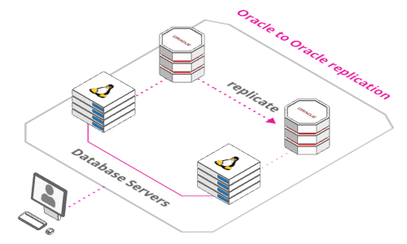
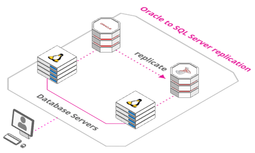
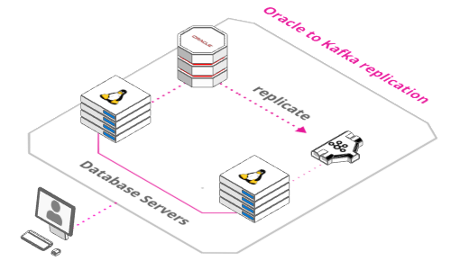

# Vagrant for Quest Shareplex

The Vagrant scripts here will allow you to build virtual machines in your computer to simulate replication between Oracle VM's and SQLServer and Kafka machines.

Features:

* Replication from Oracle 12c to Oracle 12c
* Replication from Oracle 12c to SQLServer
* Replication from Oracle 12c to Kafka

## Required Software

Download and install the following software.

* [VirtualBox](https://www.virtualbox.org/wiki/Downloads)
* [Vagrant](https://www.vagrantup.com/downloads.html)
* SharePlex licenses

## Clone Repository

Pick an area on your file system to act as the base for this git repository and issue the following command. If you are working on Windows remember to check your Git settings for line terminators. If the bash scripts are converted to Windows terminators you will have problems.

```
git clone https://github.com/SergioRomera/shareplex.git
```

Copy the software under the "quest" directory.

Or download the quest-master.zip file in a directory and unzip.


## Architectures

[Oracle to Oracle](https://arcentry.com/app/embed.html?id=c990c073-db50-4560-84fe-813ebbe44f21)

{:target="_blank" rel="noopener"}
[](https://arcentry.com/app/embed.html?id=c990c073-db50-4560-84fe-813ebbe44f21){:target="_blank" rel="noopener"}


  
[Oracle to SQL Server](https://arcentry.com/app/embed.html?id=d49e0999-c6a2-4d6e-a0eb-8a3363dc6172)



  
[Oracle to Kafka](https://arcentry.com/app/embed.html?id=04e162c7-2263-47a7-aa0c-42dfc0d139ac)



