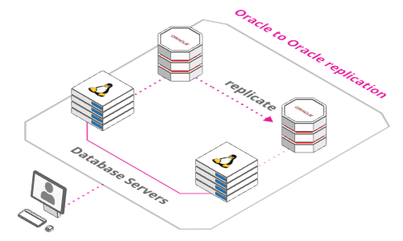

# Vagrant for Quest Shareplex

The Vagrant scripts here will allow you to build virtual machines in your computer with an Oracle Linux 7.5, an Oracle Database 12cR1 and **Shareplex 9.4** in node 1 and 2 just starting the VMs in the correct order.

Features:

* Replication from Oracle 12c to Oracle 12c

## Required Software

Download and install the following software.

* [VirtualBox](https://www.virtualbox.org/wiki/Downloads)
* [Vagrant](https://www.vagrantup.com/downloads.html)
* SharePlex licenses

## Clone Repository

Pick an area on your file system to act as the base for this git repository and issue the following command. If you are working on Windows remember to check your Git settings for line terminators. If the bash scripts are converted to Windows terminators you will have problems.

```
git clone https://github.com/SergioRomera/shareplex.git
```

Copy the software under the "quest" directory.

Or download the shareplex-master.zip file in a directory and unzip.


## Architecture

[Oracle to Oracle](https://arcentry.com/app/embed.html?id=d3cafd55-f92c-4105-88be-7cb40b5e914f)

[](https://arcentry.com/app/embed.html?id=d3cafd55-f92c-4105-88be-7cb40b5e914f)

# Licenses
Shareplex and Foglight require licenses. This step is mandatory. Put your licenses in this files:

* Shareplex license

```
└───software
        shareplex_customer_name.txt
        shareplex_licence_key.txt
```

# Build the Shareplex System

The following commands will leave you with a functioning Shareplex installation.

Start the first node and wait for it to complete. This will create the primary database.

```
#Primary Oracle DB
cd node1
vagrant up
```

# Build Oracle replicated System

The following commands will leave you with a functioning Oracle replicated installation.

Start the node 2 and wait for it to complete.

```
cd ../node2
vagrant up
```

# Turn Off System

Perform the following to turn off the system cleanly.


```
cd ../node2
vagrant halt

cd ../node1
vagrant halt
```

# Remove Whole System

The following commands will destroy all VMs and the associated files, so you can run the process again.

```
cd ../node2
vagrant destroy -f

cd ../node1
vagrant destroy -f
```

# Shareplex configuration

**Virtual Machine 1**
```
Machine name: ol7-121-splex1
Machine port: 2201

Database name: pdb1
Oracle user: test
Oracle password: test

Database connection string: 

sqlplus test/test@pdb1

Shareplex commands:

gocop                    -> Start SharePlex
spc                      -> SharePlex console
  show                   -> Show process
  list config            -> List SharePlex config files
  show config            -> Show SharePlex config
```

**Virtual Machine 2**
```
Machine name: ol7-121-splex2
Machine port: 2202

Database name: pdb1
Oracle user: test
Oracle password: test

Database connection string: 

sqlplus test/test@pdb1

Shareplex commands:

gocop                    -> Start SharePlex
spc                      -> SharePlex console
  show                   -> Show process
  list config            -> List SharePlex config files
  show config            -> Show SharePlex config
```
