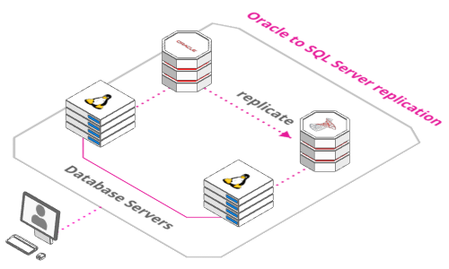

# Vagrant for Quest Shareplex

The Vagrant scripts here will allow you to build virtual machines in your computer with an Oracle Linux 7.5, an Oracle Database 12cR1 and **Shareplex 9.4** in node 1 and **SharePlex 9.2** in node 5 by just starting the VMs in the correct order.
SQL Server 2017 Express Edition has been also included in node 5. 

Features:

* Replication from Oracle to SQLServer

## Required Software

Download and install the following software.

* [VirtualBox](https://www.virtualbox.org/wiki/Downloads)
* [Vagrant](https://www.vagrantup.com/downloads.html)
* SharePlex licenses

## Clone Repository

Pick an area on your file system to act as the base for this git repository and issue the following command. If you are working on Windows remember to check your Git settings for line terminators. If the bash scripts are converted to Windows terminators you will have problems.

```
git clone https://github.com/SergioRomera/quest.git
```

Copy the software under the "quest" directory.

Or download the quest-master.zip file in a directory and unzip.


## Architecture

[Oracle to SQL Server](https://arcentry.com/app/embed.html?id=d49e0999-c6a2-4d6e-a0eb-8a3363dc6172)

[](https://arcentry.com/app/embed.html?id=d49e0999-c6a2-4d6e-a0eb-8a3363dc6172)

# Licenses
Shareplex and Foglight require licenses. This step is mandatory. Put your licenses in this files:

* Shareplex license

```
└───software
        shareplex_customer_name.txt
        shareplex_licence_key.txt
```

# Build the Shareplex System

The following commands will leave you with a functioning Shareplex installation.

Start the first node and wait for it to complete. This will create the primary database.

```
#Primary Oracle DB
cd node1
vagrant up
```

# Build SQL Server System

The following commands will leave you with a functioning SQL Server 2017 installation.

Start the node 5 and wait for it to complete.

```
cd ../node5
vagrant up
```

# Turn Off System

Perform the following to turn off the system cleanly.


```
cd ../node5
vagrant halt

cd ../node1
vagrant halt
```

# Remove Whole System

The following commands will destroy all VMs and the associated files, so you can run the process again.

```
cd ../node5
vagrant destroy -f

cd ../node1
vagrant destroy -f
```

# Shareplex configuration

**Node 1**
```
Database name: pdb1
Oracle user: hr
Oracle password: hr

Connection string: 

sqlplus hr/hr@pdb1

Shareplex commands:

gocop                    -> Start SharePlex
spc                      -> SharePlex console
  show                   -> Show process
  list config            -> List SharePlex config files
  show config            -> Show SharePlex config
```

**Node 5**
```
Database name: test
SQL Server user: SA
SQL Server password: SQLServer1

Connection string: 

/opt/mssql-tools/bin/sqlcmd -D -Stest -USA -PSQLServer01
```

